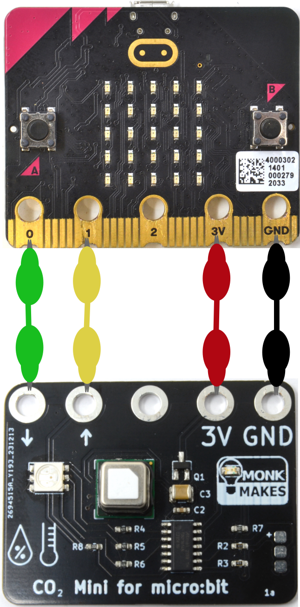

This extension makes it easy to use the [MonkMakes CO2 MINI](https://monkmakes.com/co2_mini)

## Use as Extension

This repository can be added as an **extension** in MakeCode.

* open [https://makecode.microbit.org/](https://makecode.microbit.org/)
* click on **New Project**
* click on **Extensions** under the gearwheel menu
* enter the following URL in the search field: https://github.com/monkmakes/co2_mini_makecode_extension.git

## Connecting Your micro:bit

Your micro:bit uses pins 0 and 1 to communicate with the CO2 Mini's serial interface. Use alligator clip leads to connect your micro:bit and CO2 Mini as shown below.

## Example Project
This example shows the CO2 updating every 5 seconds. Pressing button A will show the temperature in degrees C and pressing button B, the relative humidity as a percentage.

## Documentation

A datasheet and full instructions for the CO2 Mini can be found on the [product page for the CO2 Mini Kit](https://monkmakes.com/co2_mini)

